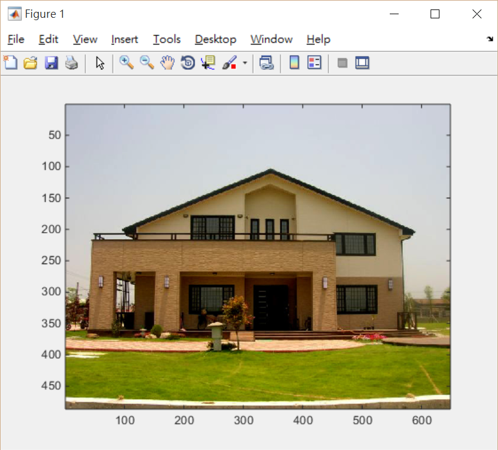
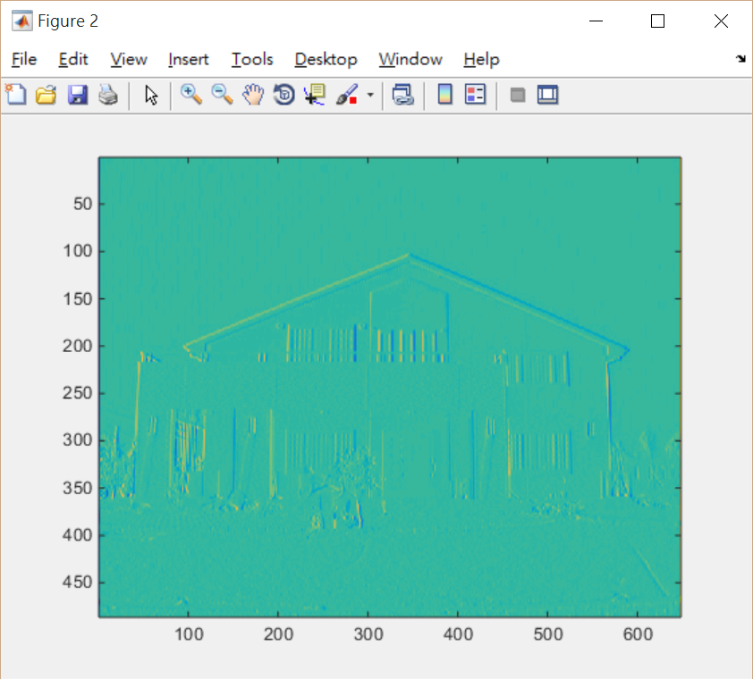
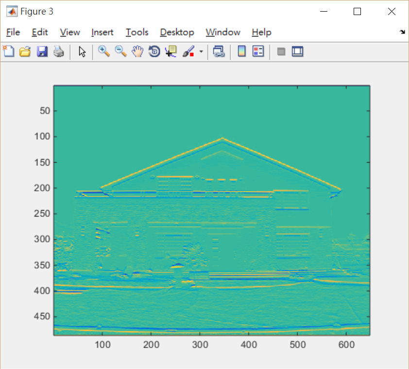
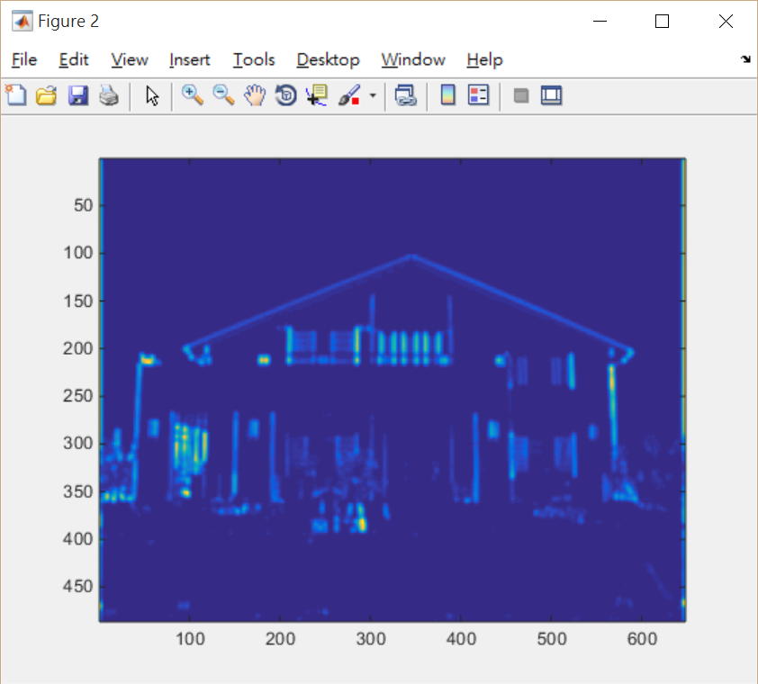
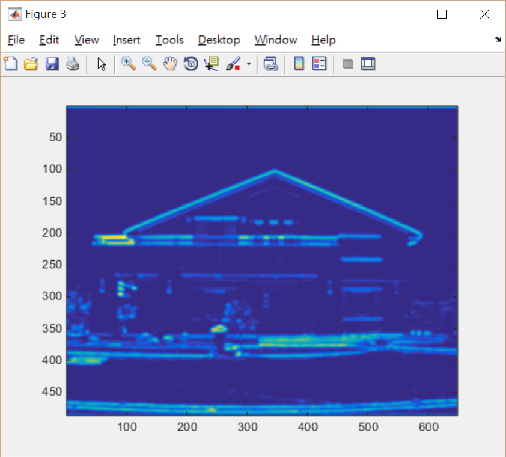
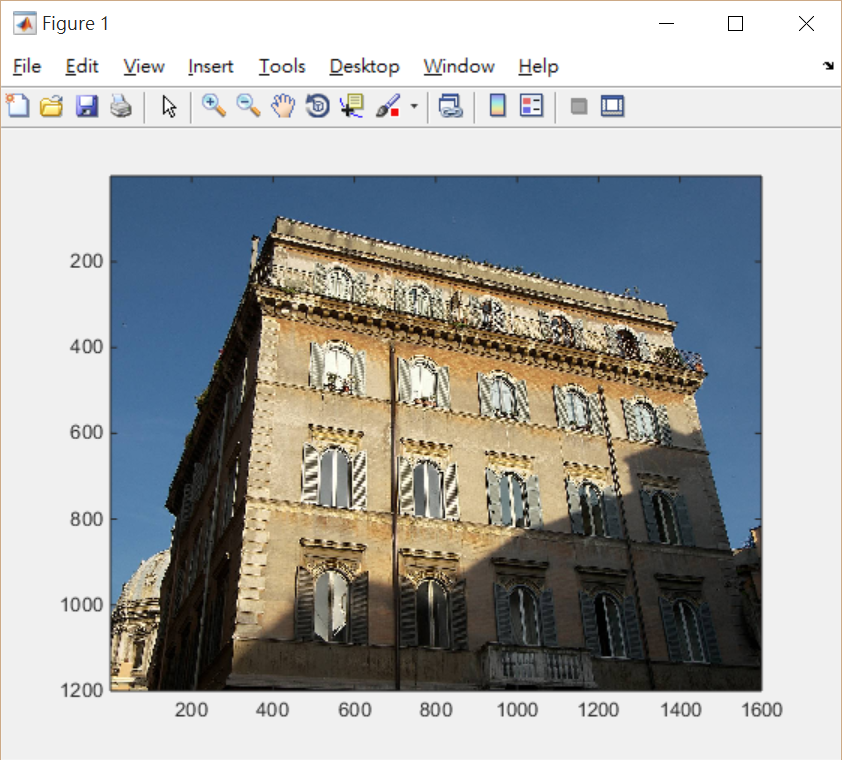
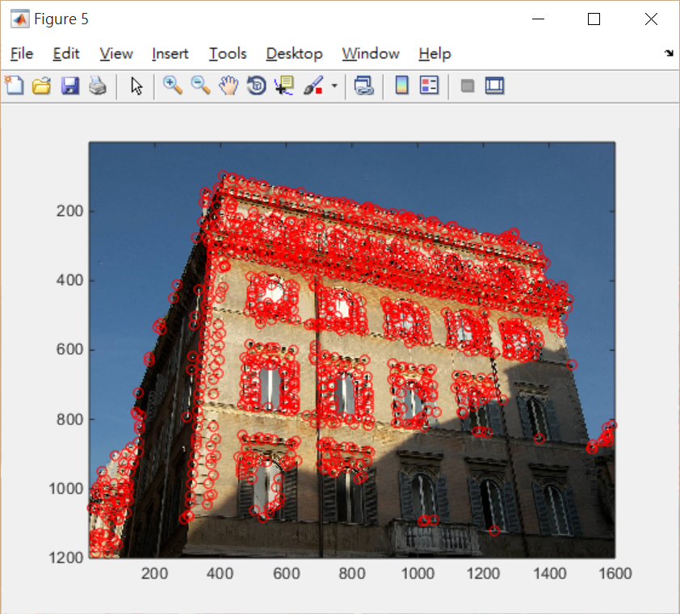
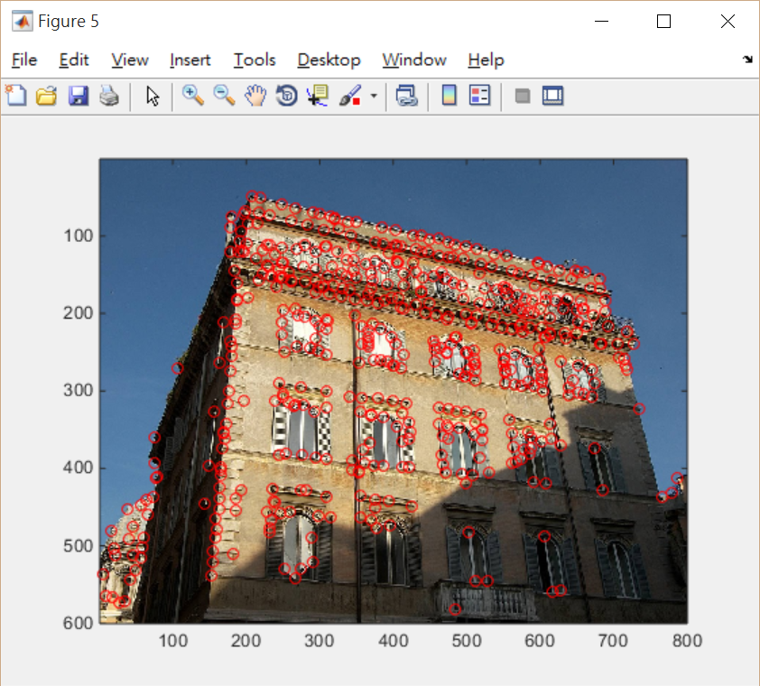
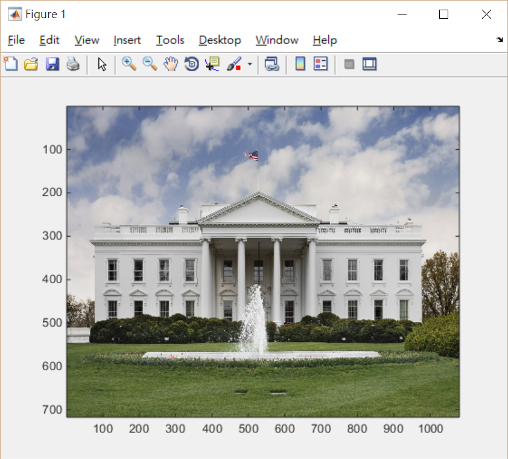
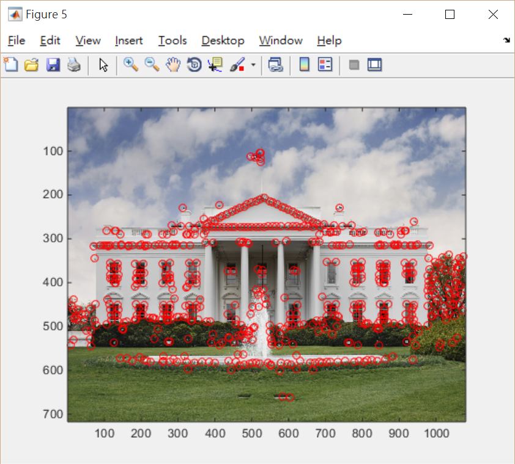

# 魏世軒 <span style="color:red">(101061111)</span>

# Project 2 / Harris Corner Detection

## Overview
The project is related to detection of corners in a image.


## Implementation
1. Image filtering(my_imfilter.m)
We built a function named "my_imfilter" to replace the MATLAB built-in "imfilter()".<br>
This function is modified from previous lab.<br>
	* Unlike the previous lab, in order to speed up the procession time, we replace the for loop type code with <br>
a matrix type coding style
	* This is accomplished by the concept of "Doing convolution in time domain is equal to doing multiplication in frequency domain."
	* Therefore, we can save number of calculations and thus CPU time in this case.
	* Same as before, first of all, we  get length and width of both filter and image:
	```
	[height, width, channel] = size(image);
	[height_fil, width_fil] = size(filter);
	```
	* % The lenth of Fourier Transorm of x(t) y(t) is M + N - 1, where x(t) has length of M; y(t) has length N.
	```
	i = height + height_fil-1;
	j = width + width_fil-1;
	```
	* Do FFT and Iinverse FFT:
	```
	output = ifft2(output);    
	output = output(floor(height_fil/2)+1:floor(height_fil/2)+1+height-1,floor(width_fil/2)+1:...
        	floor(width_fil/2)+1+width-1,:);
	```
	
2. Harris Corner detection(MyHarrisCornerDetector.m)
Hybrid image functionality is based on a fact that human eyes tend to observe high-frequency components at short distances, and tend to ignore low-frequency components at long distances. Therefore, if we combine one image that only has high frequency components and another that only has low frequency components, we will generate a :Hybrid" image. This very "Hybrid" image can make different visualizations to human as a function of distance. Actually, if you're wearing a glass, it will do the same trick if you take-off your glass.
	* % By trial and error, Thrshold=10 is the closest one to the provided picture "corner,png"
	```
	Thrshold=10;  % should be between 0 and 1000
	```
	* Initializing gradient filters dx and dy
	```
	% filter kernels
	dx = [-1 0 1; -1 0 1; -1 0 1]; % horizontal gradient filter 
	dy = dx'; % vertical gradient filter
	```
	* % Gaussien Filter: filter size 2 * n_x_sigma * sigma
	```
	g = fspecial('gaussian',max(1,fix(2*n_x_sigma*sigma)), sigma);
	```
	* Grey Scale of image I
	```
	Igrey = (I(:,:,1)*0.299+I(:,:,2)*0.587+I(:,:,3)*0.114)/255;
	```
	* Calculate Ix, Iy, Ix2, Iy2 and Ixy
	```
	Ix = my_imfilter(Igrey,dx);
	Iy = my_imfilter(Igrey,dy);
	
	% Ix2 means squared of Ix; 
	% Iy2 means squared of Iy
	Ix2 = Ix.^2;
	Iy2 = Iy.^2;
	Ixy = Ix.*Iy;
	
	% Gaussian smoothed
	Ix2 = my_imfilter(Ix2,g);
	Iy2 = my_imfilter(Iy2,g);
	Ixy = my_imfilter(Ixy,g);
	```
	* Calculate M and R
	```
	%M is by definition
	M = [[Ix2 Ixy];[Ixy Iy2]];
	%R = det(M)-alpha*trace(M)^2 
	R = Ix2.*Iy2-Ixy.^2-alpha*((Ix2+Iy2).^2);
	```
	* Calculate MX by ordfilt2
	```
	MX = ordfilt2(R,160,ones(sze,sze));
	```
	* The number '160' in ordfilt2 is found according the following concept: in order to implement a maxfilter, in MATLAB, we use ordfilt2 to filter it. Set order size as 160, this size is greater median number of our domain. 
	* First initialize RBinary
	```
	RBinary = zeros(size(R));
	```
	* Use matrix coding style to replace for loop:
	```
	RBinary((MX == R) & (MX > Thrshold)) = 1;
	% for i=1:xmax
	%     for j=1:ymax
	%         if((MX(i,j)==R(i,j))&&(MX(i,j)>Thrshold))
	%             RBinary(i,j) = 1;
	%         end
	%     end
	% end
	```
	

## Installation
* Simply download the files and run on MATLAB.


### Harris Corner detection (Sample Image)
<center>
<br>






<br>
</center>

### Harris Corner detection (Rome Building with HIGH Resolution)
<center>
<br>


</center>

### Harris Corner detection (Rome Building with LOW Resolution)
<center>
<br>


<br>
</center>

### Harris Corner detection (White House)
<center>
<br>


<br>
</center>

* Disscussion
* We can see that the picture with lower resolution will result in a fewer numbers of corner detections.
* And the one with shadows will also have fewer numbers of corner detections. I think this is due to the grey value of the shadow will be lower and thus un-easy to be larger than 'Threshold', therefore can't be detected by our code.
* My execution time is approximately "Elapsed time is 2.508870 seconds." seconds.
